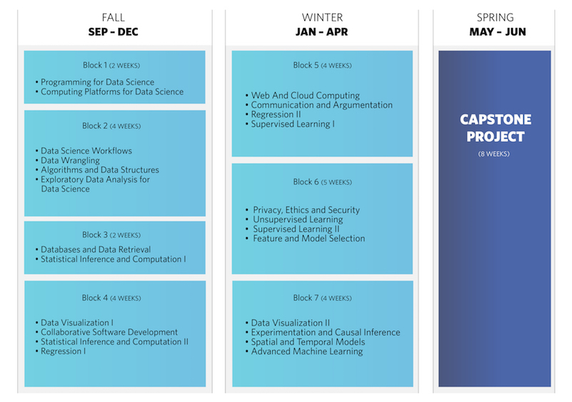
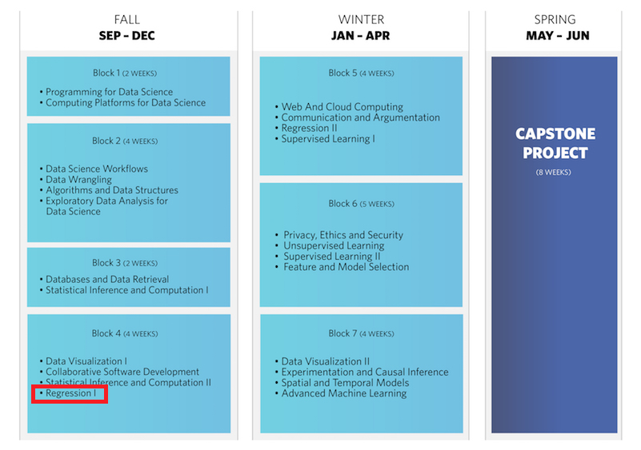
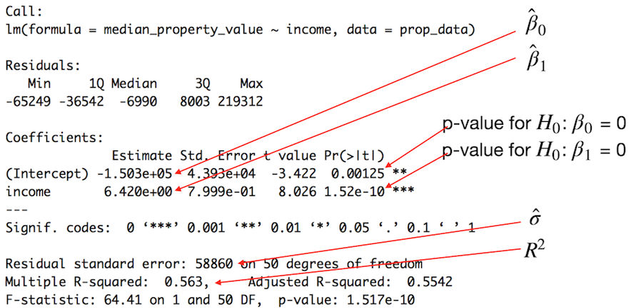

```{r setup, include=FALSE}
library(tidyverse)
library(broom)
library(scales)
library(knitr)
```

# Lesson context

## UBC MDS Curriculum

<center>
 
</br>
*source: [UBC MDS blog](https://ubc-mds.github.io/img/Course-Schedule-image.jpg)*
</center>

## UBC MDS Curriculum

<center>
 
</br>
*source: [UBC MDS blog](https://ubc-mds.github.io/img/Course-Schedule-image.jpg)*
</center>

## DSCI 561 Regression I
*(taken from public description of UBC MDS course DSCI 561)*

### Course Learning Outcomes

By the end of the course, students are expected to be able to:

  - Fit and interpret a linear regression model.
  - Identify whether a linear regression model is appropriate for a given dataset.
  - Critique a specific regression model applied to a given dataset on the basis of both diagnostic plots and hypothesis tests.
  - Specify and interpret interaction terms and nonlinear terms.

## DSCI 561 Regression I
*(adapted from public description of UBC MDS course DSCI 561)*

### Reference Materials
  - Faraway, Julian J. Linear Models with R, 2nd Edition. Chapman and Hall, 2014.
  - broom package vignette in R
  
## Sample lesson: Simple linear regression models in R

1/4 of the way into the course. Before this lesson, students will have learned the following:

  - model notation in R
  - one-way & two-way ANOVA
    - theory
    - how to do in R with `aov()`
    - how to do in R with `lm()` (including reference-treatment parameterization)
    - interaction effects
  - linear regression via ordinary least squares (theory)
  
## Sample lesson: Simple linear regression models in R

### learning objectives:
By the end of this lesson students are expected to be able to:

- fit a simple linear model in R
- interpret the output of the simple linear model object in R
- use three functions from the broom package extract simple linear model object output

# Lesson Motivation

# Sample Lesson
slides and code available at: </br>
https://github.com/ttimbers/UBC-stat-sample-lesson

## The Data:
US property data from 2015 extracted from the Data USA API using Python </br>
https://datausa.io/

```{r load data, include=FALSE, echo=FALSE}
prop_data <- read_csv("https://raw.githubusercontent.com/ttimbers/UBC-stat-sample-lesson/master/data/acs_data.csv")
prop_data$year <- NULL
```

```{r preview data, echo=FALSE}
kable(head(prop_data))
```

```{r data dim, echo=FALSE}
dim(prop_data)
```

## Simple linear regression:
<center>
<font size="5">US State property value as a function of income</font></br>


```{r plot data, echo = FALSE, fig.width = 4, fig.height = 3.5}
(prop_data_scatter <- ggplot(prop_data, aes(y = median_property_value, x = income)) +
  geom_point() +
  geom_smooth(method = "lm", se = FALSE) +
  xlab("Median State household income in 2015") +
  ylab("Median State property value in 2015") +
  scale_x_continuous(labels = dollar) +
  scale_y_continuous(labels = dollar))
```


$Y = \textrm{State}\: \textrm{median}\: \textrm{property}\: \textrm{value}$</br>
$X_{1} = \textrm{income}$

<p>
$\textrm{State}\: \textrm{median}\: \textrm{property}\: \textrm{value} = \beta_{0} + \beta_{1}\textrm{income} + \varepsilon$</br>
</center>

## Model notation for linear regression in R

### Simple linear regression:

| Mathematical formula | model formula in R |
|----------------------|--------------------|
|$Y = \beta_{0} + \beta_{1}X_{1} + \varepsilon$ | `Y ~ X1` |

### More complex linear regression:
| Mathematical formula | model formula in R |
|----------------------|--------------------|
| $Y = \beta_{0} + \beta_{1}X_{1} + \beta_{2}X_{2} + \beta_{3}X_{3} + \varepsilon$ |`Y ~ X1 + X2 + X3`| 
| $Y = \beta_{0} + \beta_{1}X_{1} + \beta_{2}X_{2} + \beta_{3}X_{1}X_{2} + \varepsilon$ | `Y ~ X1 * X2` |

<center>
<p>
### Cheatsheet for model notation in R: </br>
http://faculty.chicagobooth.edu/richard.hahn/teaching/formulanotation.pdf
</center>

## Syntax for linear regression in R
<center>
```{r plot data again, echo = FALSE, fig.width = 4, fig.height = 3.5}
(prop_data_scatter <- ggplot(prop_data, aes(y = median_property_value, x = income)) +
  geom_point() +
  geom_smooth(method = "lm", se = FALSE) +
  xlab("Median State household income in 2015") +
  ylab("Median State property value in 2015") +
  scale_x_continuous(labels = dollar) +
  scale_y_continuous(labels = dollar))
```


$\textrm{State}\: \textrm{median}\: \textrm{property}\: \textrm{value} = \beta_{0} + \beta_{1}\textrm{income} + \varepsilon$</br>

<p>
`prop_model <- lm(median_property_value ~ income, data = prop_data)`
</center>

## Syntax for simple linear regression

create linear model object and view output in base R:
```{r fit model}
prop_model <- lm(median_property_value ~ income, data = prop_data)
summary(prop_model)
```


## Decoding R’s output from `summary()`:



## Extracting output from model object in base R:

| model output | code |
|--------------|------|
| parameter/coefficient estimates (*e.g.,* $\beta_{0}$ & $\beta_{1}$) | `model_object$coefficients` |
| residuals | `model_object$residuals` |
| predicted/fitted values | `model_object$fitted.values` |
| p-values for coefficients | ` summary(model_object)$coefficients[,4]` |
| $\sigma$ estimate | `summary(model_object)$sigma` |
| $R^{2}$ |`summary(model_object)$r.squared` |

----

<center>
<font size="6">Working with model output in base R,</font></br>

<p>


<p><font size="6">the good, the bad and the ugly…</font>
</center>

----

### The good…
  - all the information you want is viewable
  - this has been used for many many many years and thus should be familiar to most Data Scientists and Statisticians

### The bad…
  - inconsistent syntax to extract model output
  - model output is returned in a variety of forms, and is not tidy data

### The ugly…
  - bizarre symbols in some column names (*e.g.,* `summary(model_object)$coefficient`)
  - F-statistic p-value is never stored in memory and thus must be calculated by hand
  
----  

<center>
<font size="6">`broom`:</font></br>
<p>

<p>
<font size="6">A better way for working with model output in R</font>
</center>

## `broom` for working with model output in R:

### The good…
  - all the information you want is stored in memory, and easy to access
  - consistent syntax
  - no weird column names
  - output is returned as data frames in tidy data format

### The bad…
  - it’s new, so not everyone is familiar with it

### The ugly…
  - ???

## `broom` for working with model output in R:

| `broom` function | model output |
|---------|--------------|
| `tidy(model_object)` |  model parameters (*e.g.,* coefficients and p-values) |
| `augment(model_object)` |  model data (*e.g.,* residuals and predicted values) |
| `glance(model_object)` |  model quality, complexity and summaries (*e.g.,* $\sigma$ estimate and $R^{2}$) |

## Example output from `tidy()`

```{r tidy example}
tidy(prop_model)
```

## Example output from `augment()`

```{r augment example}
augment(prop_model)
```

## Example output from `glance()`

```{r glance example}
glance(prop_model)
```

## Group challenge question:

<center>
https://tinyurl.com/UBC-stat-group-challenge
</center>

# What did we learn today?

## Where do we go from here?

  - finish simple linear regression
    - predicted values and confidence intervals

  - more complex linear regression models (multiple regression)
    - theory (least squares)
    - how to in R (revisit reference-treatment parameterization)
    - interaction effects in linear regression
    
  - model diagnostics 
  
  - dealing with nonlinear terms

# Questions/Discussion